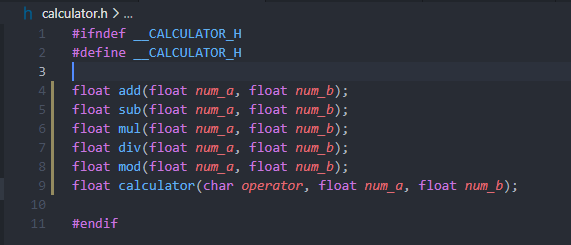
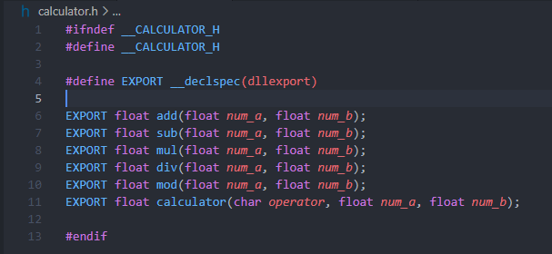
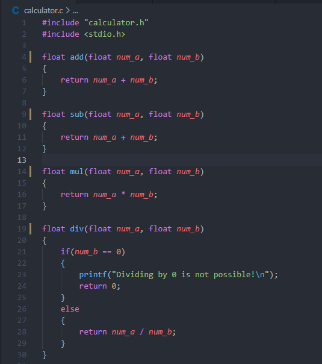

# Projekt mający na celu pokazanie możliwości testowania kodu napisanego w języku C, przy wykorzystaniu jeżyka Python oraz RobotFramework

## Instrukcja kompilacji kodu C do współdzielonej biblioteki dll

1. Edycja projektu w C.

    Przed wykonaniem kompilacji kodu w C do biblioteki DLL, należy dokonąć jego kilku modyfikacji.

    **Do linii zawierających funkcje, które chcemy eksportować do biblioteki DLL należy dodać fragment kodu `__declspec(dllexport)`**

    | Wygląd pliku przed edycją                                         | Wygląd pliku po edycji                                        |
    | :---: | :---: |
    |  |  |
    |  |  |

2. Należy skompilować projekt jak zwykły kod C do pliku **_obcject_**
   
   Wykorzystać do tego należy polecenie `gcc -c plik.c`. W tym przypadku `gcc -c calculator.c`. Projekt zostanie skompilowany oraz utworzony zostanie plik `calculator.o`.

