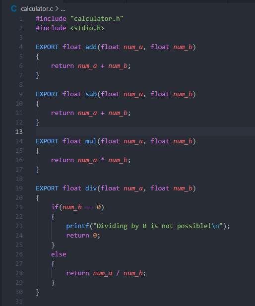

# Projekt mający na celu pokazanie możliwości testowania kodu napisanego w języku C, przy wykorzystaniu jeżyka Python oraz RobotFramework

## Instrukcja kompilacji kodu C do współdzielonej biblioteki dll

1. Edycja projektu w C.

    Przed wykonaniem kompilacji kodu w C do biblioteki DLL, należy dokonąć jego kilku modyfikacji.

    |  |  |
    |  |  |